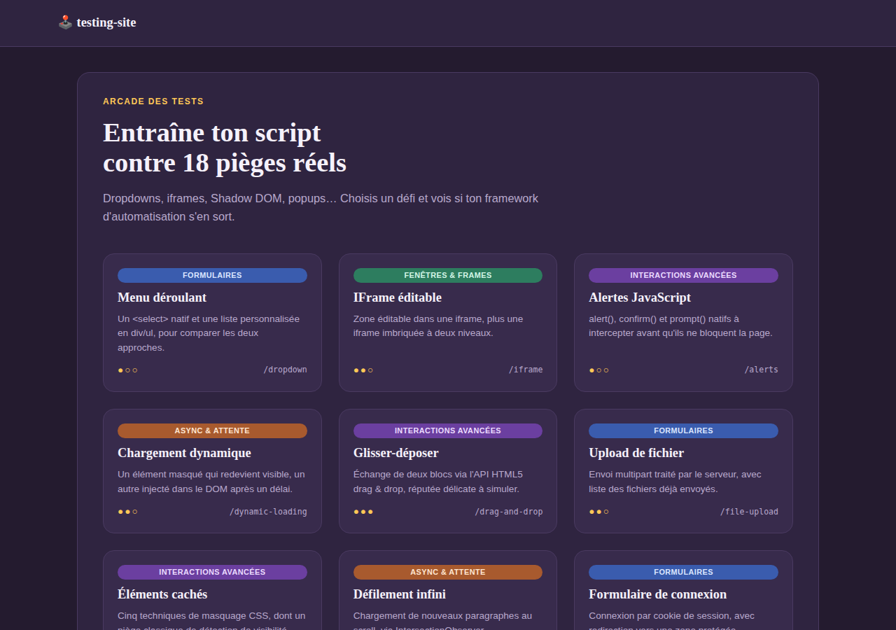
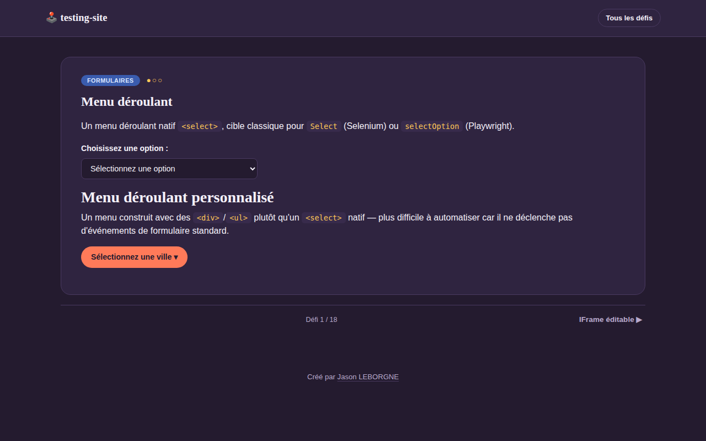

# testing-site

Site de test « bac à sable » pour s'entraîner à l'automatisation web (Selenium, Playwright, Cypress, Puppeteer…). Chaque page reproduit un défi classique d'automatisation avec des sélecteurs stables (`id` et `data-testid`).

<p align="center">
  
  
</p>

## Design : Arcade des tests

Le site utilise un habillage Bootstrap 5 sur mesure (« Arcade des tests ») : fond prune sombre, accents corail/or, typographies Fraunces (titres) + Manrope (texte), et une page d'accueil en grille de cartes façon sélection de niveau. Chaque défi affiche sa catégorie (badge coloré) et sa difficulté (● ● ○) dans l'en-tête, avec une navigation « défi précédent / suivant » en pied de page.

- Bootstrap est installé via npm (`node_modules/bootstrap`) et servi localement sur `/vendor/bootstrap` (pas de dépendance à un CDN).
- Les styles propres au site sont dans `public/css/style.css`, qui surcharge les variables CSS de Bootstrap (`--bs-*`) plutôt que de dupliquer ses composants.
- `data/challenges.js` exporte désormais `{ challenges, categories }` : chaque défi a une `category` (`formulaires`, `async`, `frames`, `reseau`, `avancees`) et une `difficulty` (1 à 3).
- Le défi affiché dans l'en-tête/pied de page (`current`) est déduit automatiquement de l'URL par un middleware dans `server.js` (comparaison avec `challenge.path`) : aucune vue n'a besoin de le repasser explicitement à `partials/footer`.

## Prérequis

- Node.js ≥ 18 (testé avec Node v22)
- npm

## Installation

```bash
npm install
```

## Lancer le site

```bash
npm start        # démarrage simple
npm run dev       # avec rechargement automatique (nodemon)
```

Le site est servi sur http://localhost:3000 (variable `PORT` surchargeable).

## Pages disponibles

| Page | URL | Catégorie | Ce qu'elle teste |
|---|---|---|---|
| Menu déroulant | `/dropdown` | Formulaires | `<select>` natif + menu déroulant personnalisé (div/ul) |
| IFrame éditable | `/iframe` | Fenêtres & frames | contenu éditable dans une iframe, iframes imbriquées |
| Alertes JavaScript | `/alerts` | Interactions avancées | `alert`, `confirm`, `prompt` |
| Chargement dynamique | `/dynamic-loading` | Async & attente | élément masqué (display:none) vs élément inséré après coup |
| Glisser-déposer | `/drag-and-drop` | Interactions avancées | API HTML5 drag & drop |
| Upload de fichier | `/file-upload` | Formulaires | formulaire multipart, stockage sur disque (Multer) |
| Éléments cachés | `/hidden-elements` | Interactions avancées | display:none, visibility:hidden, opacity:0, hors écran, taille nulle |
| Défilement infini | `/infinite-scroll` | Async & attente | chargement asynchrone au scroll (IntersectionObserver) |
| Connexion | `/login` → `/secure` | Formulaires | formulaire + cookie de session (`testuser` / `Test1234!`) |
| Tableau triable | `/tables` | Interactions avancées | tri de colonnes côté client |
| Codes de statut HTTP | `/status-codes` | Réseau & HTTP | 200, 301 (redirection réelle), 404, 500 |
| Shadow DOM | `/shadow-dom` | Interactions avancées | web component avec Shadow DOM fermé au CSS global |
| Ressource lente | `/slow-resource` | Async & attente | image et appel JSON avec ~3s de délai artificiel |
| Images cassées | `/broken-images` | Réseau & HTTP | image valide, 404, erreur serveur 500 |
| Fenêtres multiples | `/multiple-windows` | Fenêtres & frames | ouverture d'un nouvel onglet (lien + `window.open`) |
| Authentification HTTP Basic | `/basic-auth` | Réseau & HTTP | challenge 401 + en-tête `Authorization` (`admin` / `admin`) |
| Redirection | `/redirect` | Réseau & HTTP | redirection HTTP 302 réelle |
| Cases à cocher | `/checkboxes` | Formulaires | états initiaux différents + (dé)sélection globale |

## Structure du projet

```
server.js             point d'entrée Express (déduit aussi `current` depuis l'URL)
routes/index.js       toutes les routes
data/challenges.js    { challenges, categories } — alimente la grille d'accueil et la nav
views/                templates EJS (partials/header.ejs + partials/footer.ejs communs)
public/css/style.css  styles Arcade (surcharge des variables Bootstrap)
public/js/*.js        scripts client, un fichier par défi
uploads/               fichiers envoyés via /file-upload (ignoré par git, sauf .gitkeep)
```

## Ajouter un nouveau défi

1. Ajouter une entrée dans `data/challenges.js` (`path`, `id`, `title`, `category`, `difficulty`, `desc`).
2. Ajouter la route correspondante dans `routes/index.js`.
3. Créer la vue `views/<nom>.ejs` (s'inspirer d'une vue existante pour les includes header/footer).
4. Si besoin d'interactivité, ajouter `public/js/<nom>.js` et le référencer via `script` dans `include('partials/footer', { script: '/js/<nom>.js' })`.

## Tests automatisés (Playwright)

Une suite Playwright complète (`tests/`) couvre les 18 pages du site — dialogues natifs, Shadow DOM, iframes imbriquées, glisser-déposer, upload de fichier, codes HTTP réels, authentification Basic, popups, etc.

### Installation

```bash
npm install
npx playwright install chromium   # télécharge le navigateur Chromium de Playwright
```

> Si `npx playwright install` échoue avec une erreur réseau (`blocked by network allowlist` ou équivalent), c'est que votre réseau/pare-feu bloque `cdn.playwright.dev`. Demandez à votre administrateur d'autoriser ce domaine, ou lancez la commande depuis un réseau sans cette restriction.

### Lancer les tests

```bash
npm test              # tous les tests, en mode headless
npm run test:headed   # avec le navigateur visible
npm run test:ui       # mode interactif (UI Mode de Playwright)
npm run test:report   # rouvrir le dernier rapport HTML
```

Le fichier `playwright.config.js` démarre automatiquement le serveur (`npm start`) avant les tests via l'option `webServer`, donc pas besoin de le lancer à la main.

### Ce que la suite illustre

- `tests/hidden-elements.spec.js` montre que Playwright ne considère **pas** `opacity:0` comme caché, mais considère (à tort, du point de vue visuel) un élément dans un conteneur 0×0 avec `overflow:hidden` comme "visible" — un piège classique.
- `tests/shadow-dom.spec.js` montre que les locators Playwright traversent automatiquement le Shadow DOM.
- `tests/status-codes.spec.js` et `tests/basic-auth.spec.js` utilisent la fixture `request` (sans navigateur) pour vérifier les codes HTTP et en-têtes directement.

### Organisation en Page Object Model

Les tests ne contiennent **aucun sélecteur brut** : chaque page du site a sa classe dans `tests/pages/<Nom>Page.js`, qui centralise ses `data-testid` et ses actions (`goto()`, `login()`, `swapColumns()`...). Les specs récupèrent ces objets via des fixtures Playwright définies dans `tests/fixtures.js` (`dropdownPage`, `loginPage`, `tablesPage`, etc.) plutôt que d'importer `@playwright/test` directement.

```
tests/
  routes.js         chemins/URLs du site, utilisés par les Page Objects et les tests API
  fixtures.js        test.extend() qui injecte un Page Object par page (import unique pour tous les specs)
  pages/
    BasePage.js       classe de base (juste `this.page`)
    HomePage.js        ex: locators de la grille de défis (brand, challengeCards, card(id))
    LoginPage.js       ex: locators + méthode login(username, password)
    ...                un fichier par page
  *.spec.js           les tests eux-mêmes, sans aucun sélecteur en dur
```

**Si un `id`/`data-testid` change sur le site**, une seule ligne à modifier : dans `tests/pages/<Nom>Page.js`, à l'endroit où le locator est déclaré. Aucun fichier `*.spec.js` à toucher.

```js
// tests/pages/AlertsPage.js
this.alertButton = page.getByTestId('btn-alert'); // ← seul endroit à changer
```

### Ajouter des tests pour un nouveau défi

1. Créer `tests/pages/<Nom>Page.js` (hériter de `BasePage`, déclarer les locators + `goto()`).
2. L'enregistrer comme fixture dans `tests/fixtures.js`.
3. Créer `tests/<nom>.spec.js` avec `const { test, expect } = require('./fixtures');` et utiliser le fixture (`async ({ maPage }) => { ... }`).
